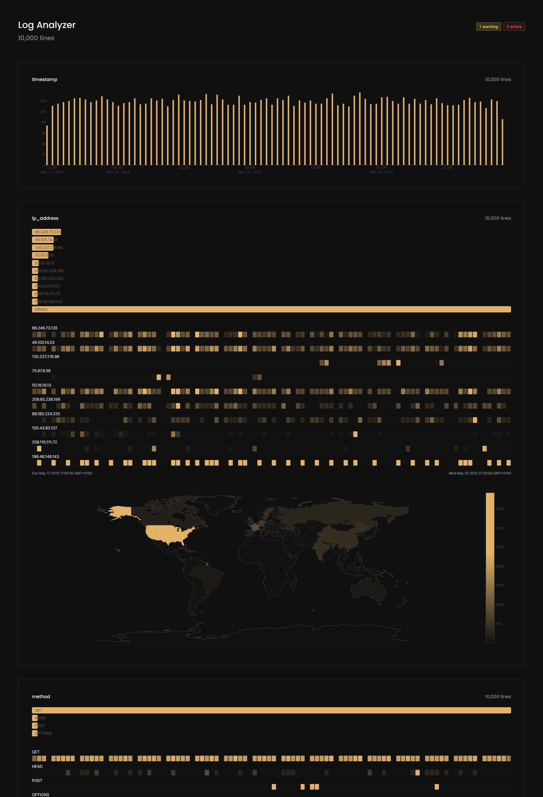

# log-analyzer-plus

本项目改编自[log-analyzer](https://github.com/tom-draper/log-analyzer)

现在你可以用正则表达式定义token的lexeme（可选），使得识别更为准确。例如匹配

```
2015-07-12 14:59:23 :: process1 - starting process 1
2015-07-12 14:59:23 :: process2 - starting process 2
2015-07-12 14:59:23 :: process3 - starting process 3
2015-07-12 14:59:23 :: process4 - starting process 4
2015-07-12 14:59:24 :: process1 - WARNING
    -> warning from process 1
2015-07-12 14:59:25 :: process2 - WARNING
    -> warning from process 2
2015-07-12 14:59:27 :: process4 - CRITICAL ERROR
    -> error in process 4
    -> shutting down
2015-07-12 14:59:27 :: process4 - stopping process 4
2015-07-12 14:59:30 :: process3 - complete
2015-07-12 14:59:30 :: process3 - stopping process 3
2015-07-12 14:59:31 :: process1 - complete
2015-07-12 14:59:31 :: process1 - stopping process 1
2015-07-12 14:59:33 :: process2 - complete
2015-07-12 14:59:33 :: process2 - stopping process 2
```

可以用以下config：

`config.json`

```json
{
  "tokens": [
    "timestamp",
    "process",
    "message",
    "error_msg",
    "action",
    "status"
  ],
  "patterns": [
    "timestamp :: process - message",
    "timestamp :: process - status\n    -> error_msg",
    "timestamp :: process - status\n    -> error_msg\n    -> action"
  ],
  "lexemes": {
    "timestamp": "\\d{4}-\\d{2}-\\d{2} \\d{2}:\\d{2}:\\d{2}"
  }
}
```

`./main -c tests\data\configs\multiline.json -p tests\data\logs\multiline.log`

## 截图


